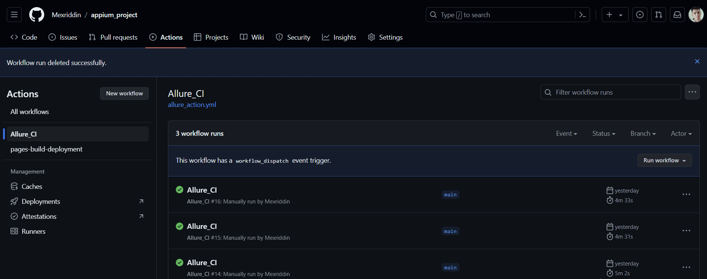
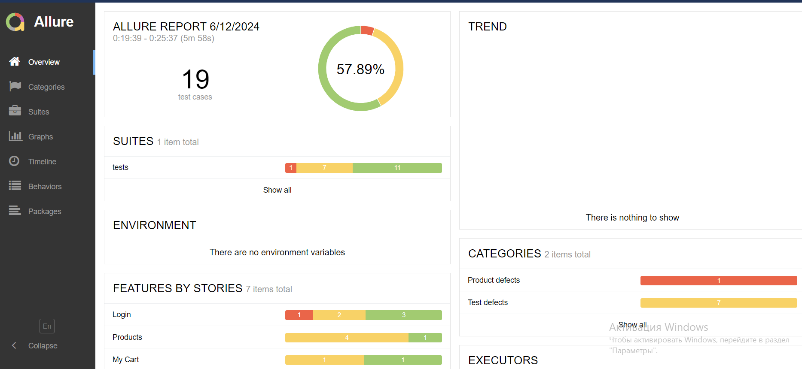
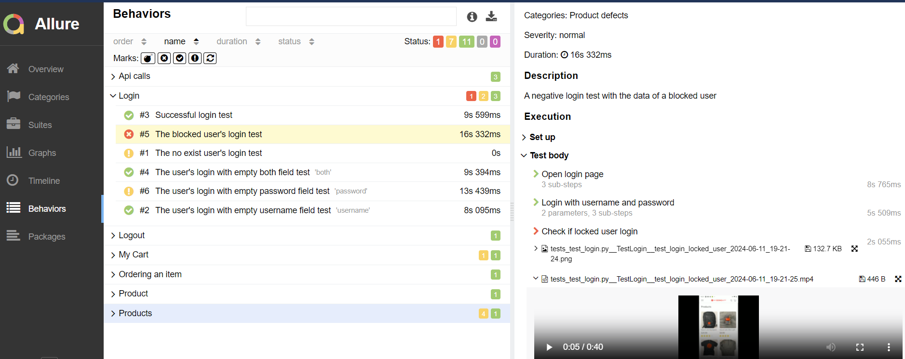
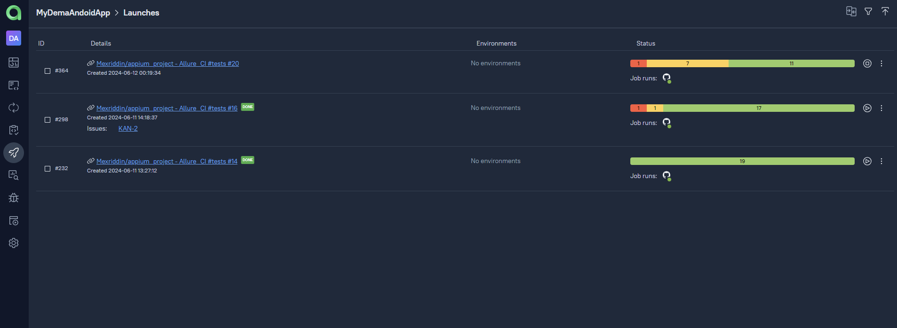
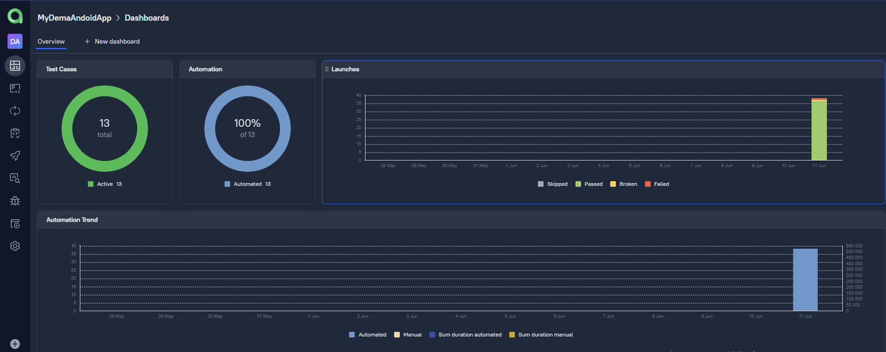
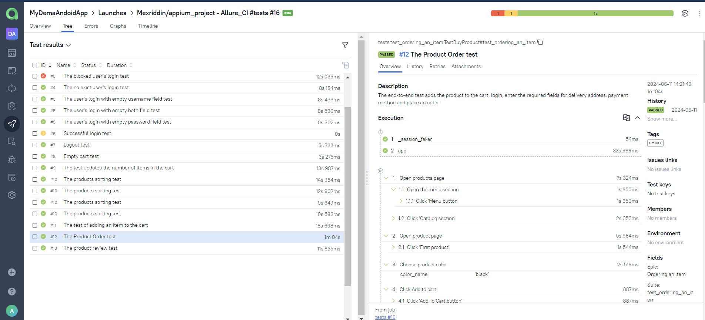
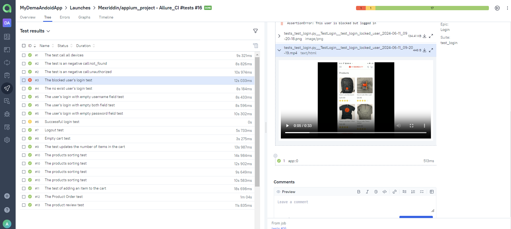
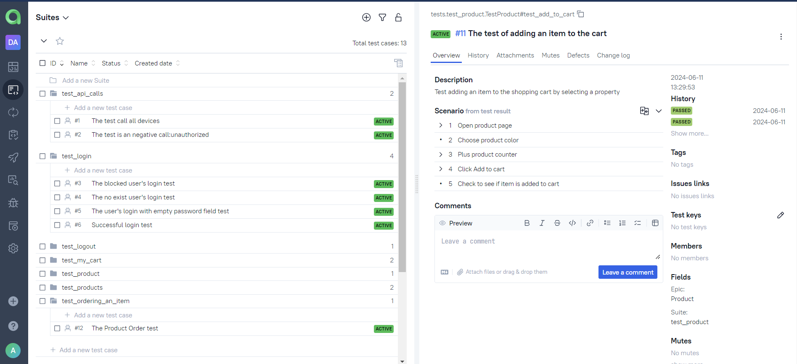
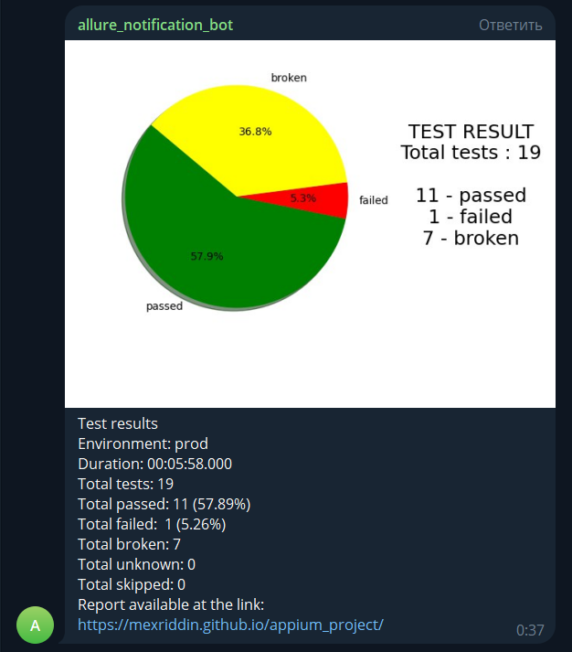

# Проект по автоматизации тестирования мобильного приложения MY DEMO APP

<br>
<p align="center">

</p>
<br>

##  📌Содержание:

- [Использованный стек технологий](#tools)
- [Реализованные проверки](#checks)
- [Запуск тестов](#test_run)
- [Сборка в GitHub Action](#github-action)
- [Пример Allure-отчета](#allure_report)
- [Интеграция с Allure TestOps](#testops)
- [Уведомления в Telegram с использованием бота](#notification)
- [Видео примера запуска теста в BrowserStack](#browserstack)

<h2 id="tools">Использованный стек технологий</h2>

<p align="center">
<code><a href="https://www.python.org/"></a></code>
<code><a href="https://www.jetbrains.com/pycharm/"></a></code>
<code><a href="https://docs.pytest.org/"></a></code>
<code><a href="https://python-poetry.org/"></a></code>
<code><a href="https://appium.io/"></a></code>
<code><a href="https://developer.android.com/"></a></code>
<code><a href="https://www.browserstack.com/"></a></code>
<code><a href="https://allurereport.org/"></a></code>
<code><a href="https://qameta.io/"></a></code>
<code><a href="https://telegram.org/"></a></code>
<code><a href="https://github.com/"></a></code>
<code><a href="https://docs.github.com/ru/actions"></a></code>
</p>


Запуск тестов можно осуществлять локально или с помощью [BrowserStack](https://www.browserstack.com/).
Также реализована сборка в <code>GitHub Action</code> с формированием Allure-отчета и отправкой уведомления с результатами в <code>Telegram</code> после завершения прогона.

Автотесты написаны на `Python` с использованием фреймворк `Appium`.
- `Poetry` - используется в качестве инструмента сборки зависимости.
- `Pytest` - to execute tests.
- `Appium, Android Studio` - для выполнения тестов локально на машине
- `Browserstack` - для удаленного проведения тестов.
- `GitHub Action` - CI/CD для удаленного выполнения тестов.
- `Telegram Bot` - для уведомлений о результатах теста.
- `Allure Report` - для результатов теста визуализация.
- `Allure TestOps` - в качестве системы управления тестами.

Allure-отчет включает в себя:
* шаги выполнения тестов;
* скриншот и видеозапись экрана в устройстве в момент подение автотеста;
* логи браузерной консоли;


 <h2 id="checks">Реализованные проверки </h2>
- [x] *Проверка логирование пользователя*
- [x] *Проверка добавление продукта в корзинку*
- [x] *Проверка сортировки продуктов*
- [x] *Проверка оформление покупки*
- [x] *Проверка АПИ запросов*

<h2 id="test_run">Запуск тестов</h2>
Перед выполением необходимо:
* в .env определить параметры конфигурации:
    - `BROWSERSTACK_USERNAME`
    - `BROWSERSTACK_ACCESS_KEY`
    - `TG_TOKEN`
    - `CHAT_ID`

### Локальный запуск тестов
```sh
poetry run pytest --mode_run local_em
```
При необходимости можно переопределить параметры запуска
```
pytest -m  positive - запуск позитивных тестов
pytest -m  negative - запауск негативных
pytest -m  smoke - только smoke
```

### Запуск тестов на удаленном браузере
```sh
poetry run pytest --mode_run remote_bs
```
При необходимости также можно переопределить параметры запуска

<h2 id="github-action"> <a href="https://github.com/Mexriddin/appium_project/actions/workflows/allure_action.yml"> Сборка в GitHub Action</a></h2>

<p align="center">

</p>

<h2 id="allure_report"> <a href="https://mexriddin.github.io/appium_project/">Пример Allure-отчета</a></h2>

### Обзор

<p align="center">

</p>

### Результат выполнения теста

<p align="center">

</p>

<h2 id="testops">  <a href="https://blab.testops.cloud/project/1/test-cases?treeId=0">Интеграция с Allure TestOps</a></h2>

### Запуски

<p align="center">
  
</p>

### Основной дашборд

<p align="center">
  
</p>

### Список тестов с результатами прогона

<p align="center">
  
</p>

### Успешный тест

<p align="center">
  
</p>

### Проваленный тест

<p align="center">
  
</p>

### Тест-кейсы

<p align="center">
  
</p>


<h2 id="notification"> Уведомления в Telegram с использованием бота</h2>

После завершения сборки специальный бот, созданный в <code>Telegram</code>, автоматически обрабатывает и отправляет сообщение с отчетом о прогоне.

<p align="center">

</p>

###  Видео примера запуска теста в BrowserStack

К каждому тесту прилагается видео. Одно из таких видео представлено ниже.
<p align="center">
  
</p>

###  Видео примера запуска теста в эмуляторе
<p align="center">
  
</p>
